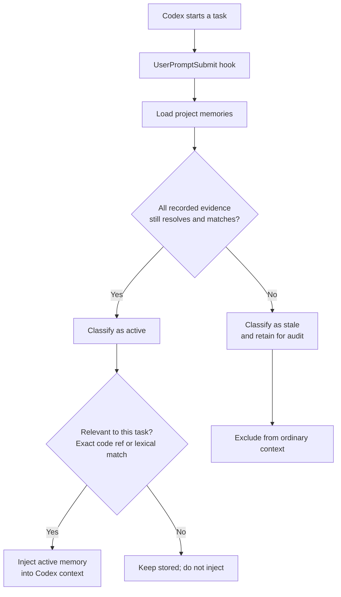
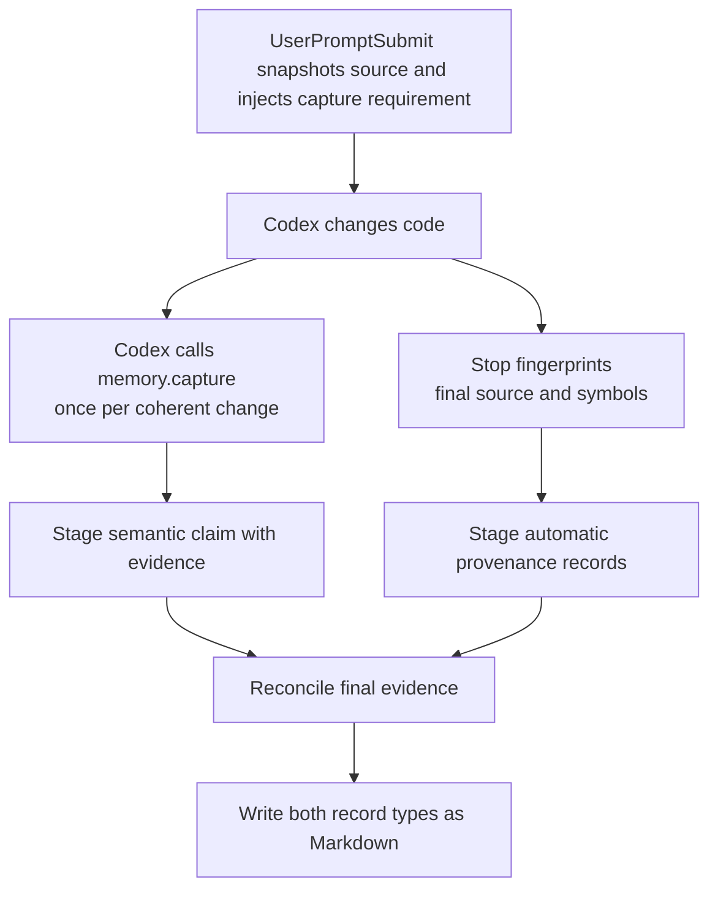

# Memory Stale

**Persistent project memory that stops being trusted when its code evidence changes.**

Memory Stale gives Codex durable, code-anchored context across tasks. It stores
claims as reviewable Markdown, connects each claim to specific code evidence,
and deterministically marks the claim `stale` when that evidence no longer
matches.

It is installed per repository as a local Codex skill with hooks. Its MCP
server is registered once in Codex's global configuration, but the entry points
only to that project's installed runtime. It does not use Codex Plugins,
another model, embeddings, a hosted service, or a vector database.

## Why it matters

Codex can remember that `AuthService.login` only checks a password. If MFA is
added later, that fact is now unsafe. Memory Stale keeps the claim only while
the recorded code still supports it.

```text
unchanged evidence → active memory → available to Codex
changed evidence   → stale memory  → excluded until revalidated
```

`active` means the recorded evidence is unchanged; it is not proof that a claim
is complete or universally true. `stale` means evidence changed, disappeared,
or no longer resolves; it is not proof the claim is false.

## Install in a project

From the target Git repository, ask Codex:

> Install Memory Stale in this project from https://github.com/fagnermourafeitosa/memory-stale

Or run:

```bash
git clone https://github.com/fagnermourafeitosa/memory-stale.git /tmp/memory-stale
sh /tmp/memory-stale/scripts/install-project.sh .
```

The installer adds only target-project artifacts:

```text
.agents/skills/memory-stale/  # skill, hooks, Python runtime, lockfile
.codex/hooks.json             # lifecycle registrations
.git/memory-stale/runtime/    # local uv and grammar caches
```

It preserves unrelated hook entries and registers `memory-stale` with
`codex mcp add` using the installed runtime's absolute path. The Codex
registration is global, but it does not install Python packages globally or
point to the source checkout. If Codex already has a `memory-stale` server,
installation stops with the CLI's error instead of replacing it. Start a new
Codex conversation after installation so it loads the registered server.

Requirements: Git, `uv`, Python 3.10+, and the `codex` CLI with MCP support.

On the first hook or MCP invocation, the installed runtime uses its locked
dependencies to run `uv sync --frozen --no-dev`. This creates or reuses an
isolated environment at `.git/memory-stale/runtime/.venv`; its `uv` and
grammar caches also remain below `.git/memory-stale/runtime/`. It does not
modify the target project's `.venv` or install packages globally.

## How memory is discovered and classified

On every task, the `UserPromptSubmit` hook considers only records whose evidence
is still valid. It retrieves relevant active claims deterministically: exact
paths/symbols receive priority and remaining matches use lexical BM25 ranking.



This means a comment-only or formatting-only edit does not invalidate a memory,
while a semantic change to its referenced source does.

## How a memory is created

Every supported code change produces two complementary records. The local
runtime creates deterministic provenance for the added or changed code
locations. The Codex instance performing the task submits a concise semantic
claim describing what the coherent change now does or guarantees. Memory Stale
does not ask another LLM or generate that claim inside the local engine.



For example, one coherent change may create these automatic provenance records:

```text
Automatic change record: changed symbol src/jobs.py:retry.
Automatic change record: changed symbol tests/test_jobs.py:test_retry_limit.
```

Alongside them, Codex submits the memory content used for conceptual retrieval:

```text
Failed jobs retry at most three times before surfacing the final failure.
Evidence: src/jobs.py:retry, tests/test_jobs.py:test_retry_limit
```

The claim supplies what later tasks should remember and participates in lexical
retrieval. Provenance supplies exact code matching and determines whether the
claim remains `active`. If semantic capture does not cover a changed location,
`Stop` preserves its automatic provenance and reports the missing coverage.

## Daily use

Memory maintenance is automatic:

1. `UserPromptSubmit` retrieves relevant active memory.
2. `PostToolUse` records work performed during the task.
3. Codex calls `memory.capture` before its final response once per coherent
   supported-code change.
4. `Stop` captures automatic provenance, persists both record types, reports
   semantic coverage gaps, and marks affected existing records stale.

Ask Codex to work normally; the installed skill and hooks handle this protocol
without requiring the user to issue a memory command. For explicit maintenance,
use:

```text
/memory-stale dream
```

Ask Codex for the Memory Stale health report to generate the local HTML view of
active/stale memories, evidence, and invalidation reasons.

## What is stored

Durable records and configuration live in the target project:

```text
.agents/skills/.agent-memory/memories/*.md
.agents/skills/.agent-memory/config.toml
```

Memory files are Git-reviewable Markdown. Commit them when the team wants to
share project knowledge. Turn ledgers and runtime caches remain under `.git/`.

Each completed supported-code change stores automatic symbol/source provenance
and at least one Codex-authored semantic claim covering its coherent meaning.
Automatic primary evidence is a parsed symbol when available, otherwise a
parsed source file; it supports Python, JavaScript/TypeScript, Go, Java, Kotlin,
and Rust. Semantic captures may also use symbols, tests, configuration nodes,
and schema nodes. Unsupported languages intentionally have no fallback.

## Design boundaries

- **Codex supplies meaning.** It decides whether a fact is durable and states
  the claim.
- **The local core supplies proof of freshness.** It resolves declared evidence,
  fingerprints it, retrieves active records, and manages lifecycle state.
- **Hooks and MCP are adapters.** They keep the deterministic Python core
  independent from Codex transport and configuration.
- **Failures do not block coding.** Hook failures return actionable, non-blocking
  messages; writes are atomic.

## Current limitations

- Retrieval is lexical and structural; a prompt with no shared terms or code
  references may not retrieve a conceptually related memory.
- Stale records are excluded, not automatically rewritten. Revalidate them with
  Dream or a new capture.
- Overloads, anonymous functions, generated code, macros, and partial classes
  may not resolve at the desired granularity.
