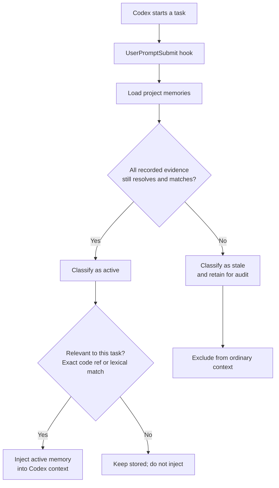
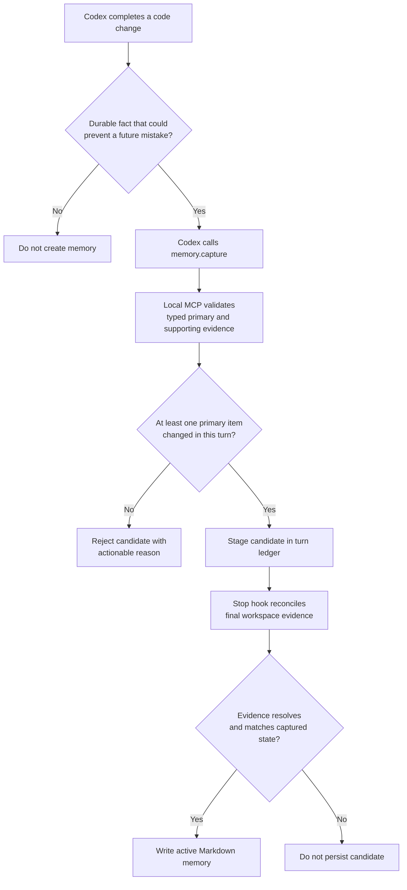

# Memory Stale

**Persistent project memory that stops being trusted when its code evidence changes.**

Memory Stale gives Codex durable, code-anchored context across tasks. It stores
claims as reviewable Markdown, connects each claim to specific code evidence,
and deterministically marks the claim `stale` when that evidence no longer
matches.

It is installed per repository as a local Codex skill with hooks and a local
MCP server. It does not use Codex Plugins, global installation, another model,
embeddings, a hosted service, or a vector database.

## Why it matters

Codex can remember that `AuthService.login` only checks a password. If MFA is
added later, that fact is now unsafe. Memory Stale keeps the claim only while
the recorded code still supports it.

```text
unchanged evidence → active memory → available to Codex
changed evidence   → stale memory  → excluded until revalidated
```

`active` means the recorded evidence is unchanged; it is not proof that a claim
is complete or universally true. `stale` means evidence changed, disappeared,
or no longer resolves; it is not proof the claim is false.

## Install in a project

From the target Git repository, ask Codex:

> Install Memory Stale in this project from https://github.com/fagnermourafeitosa/memory-stale

Or run:

```bash
git clone https://github.com/fagnermourafeitosa/memory-stale.git /tmp/memory-stale
sh /tmp/memory-stale/scripts/install-project.sh .
```

The installer adds only target-project artifacts:

```text
.agents/skills/memory-stale/  # skill, hooks, Python runtime, lockfile
.codex/hooks.json             # lifecycle registrations
.mcp.json                     # local memory-stale MCP server
.git/memory-stale/runtime/    # local uv and grammar caches
```

It preserves unrelated hook and MCP entries, rejects an incompatible existing
`memory-stale` MCP server, and never changes `~/.codex`. Review the resulting
hooks, then start a new Codex conversation to load the local configuration.

Requirements: Git, `uv`, Python 3.10+, and Codex support for project-local
skills, hooks, and MCP configuration.

## How memory is discovered and classified

On every task, the `UserPromptSubmit` hook considers only records whose evidence
is still valid. It retrieves relevant active claims deterministically: exact
paths/symbols receive priority and remaining matches use lexical BM25 ranking.



This means a comment-only or formatting-only edit does not invalidate a memory,
while a semantic change to its referenced symbol does.

## How a memory is created

Codex decides whether a completed change establishes a durable fact. The local
runtime never asks another LLM: it validates the evidence and lifecycle state.



For example, a useful memory is:

```text
Login validates password and MFA before creating a session.
Evidence: src/auth.py:AuthService.login
```

It is not a task summary such as “Added MFA to login.”

## Daily use

Memory maintenance is automatic:

1. `UserPromptSubmit` retrieves relevant active memory.
2. `PostToolUse` records work performed during the task.
3. Codex calls `memory.capture` when durable code-backed knowledge is created.
4. `Stop` reconciles evidence, persists valid candidates, and marks affected
   existing records stale.

Ask Codex to work normally. The bundled `memory-stale` skill guides its capture
decisions. For explicit maintenance, use:

```text
/memory-stale dream
```

Ask Codex for the Memory Stale health report to generate the local HTML view of
active/stale memories, evidence, and invalidation reasons.

## What is stored

Durable records and configuration live in the target project:

```text
.agents/skills/.agent-memory/memories/*.md
.agents/skills/.agent-memory/config.toml
```

Memory files are Git-reviewable Markdown. Commit them when the team wants to
share project knowledge. Turn ledgers and runtime caches remain under `.git/`.

Supported primary evidence includes symbols, tests, configuration nodes, and
schema nodes. Symbol evidence supports Python, JavaScript/TypeScript, Go, Java,
Kotlin, and Rust. Unsupported languages intentionally have no file-level
fallback.

## Design boundaries

- **Codex supplies meaning.** It decides whether a fact is durable and states
  the claim.
- **The local core supplies proof of freshness.** It resolves declared evidence,
  fingerprints it, retrieves active records, and manages lifecycle state.
- **Hooks and MCP are adapters.** They keep the deterministic Python core
  independent from Codex transport and configuration.
- **Failures do not block coding.** Hook failures return actionable, non-blocking
  messages; writes are atomic.

## Current limitations

- Retrieval is lexical and structural; a prompt with no shared terms or code
  references may not retrieve a conceptually related memory.
- Stale records are excluded, not automatically rewritten. Revalidate them with
  Dream or a new capture.
- Overloads, anonymous functions, generated code, macros, and partial classes
  may not resolve at the desired granularity.
