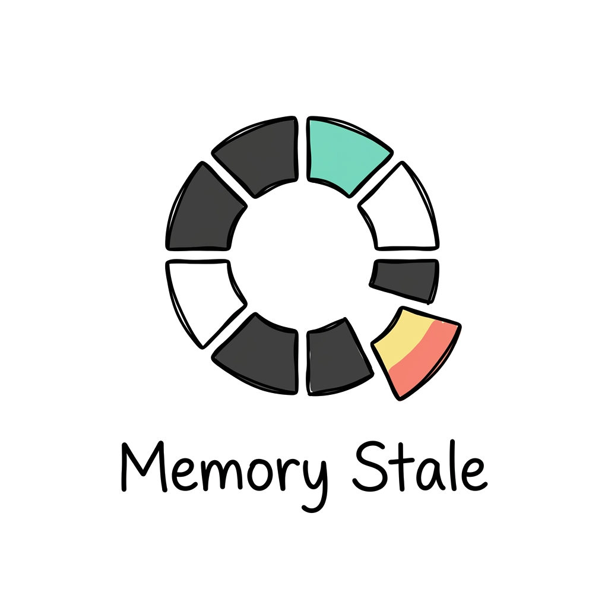
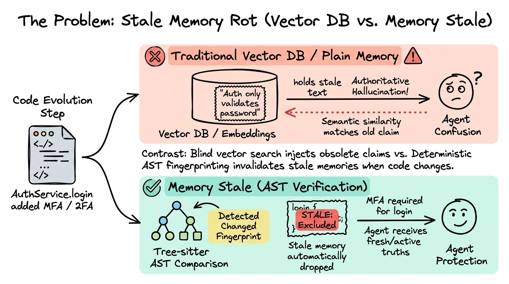
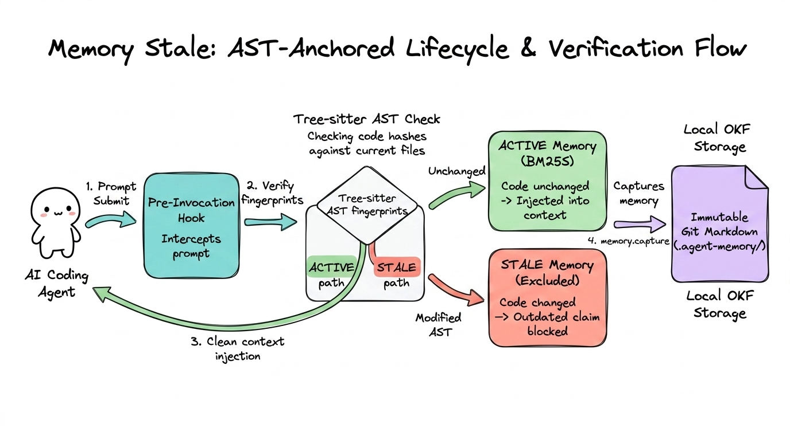
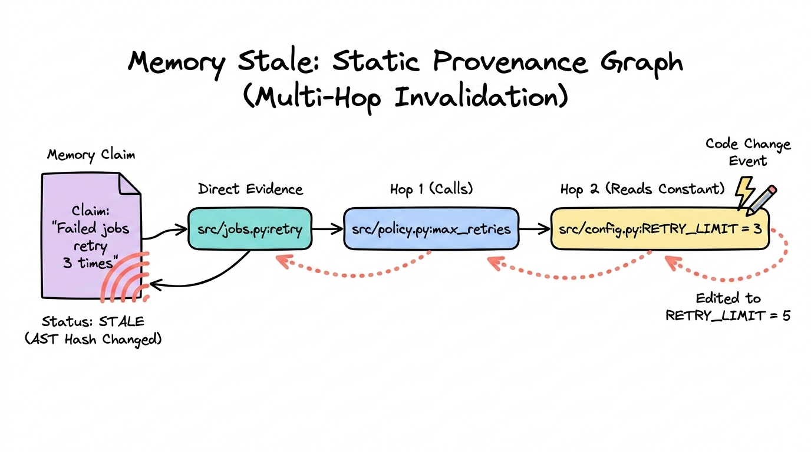
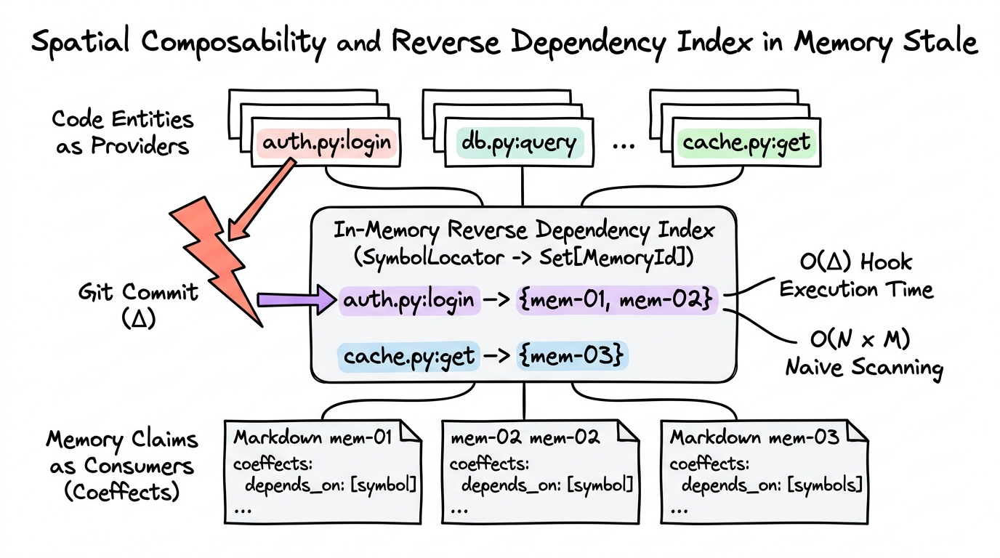
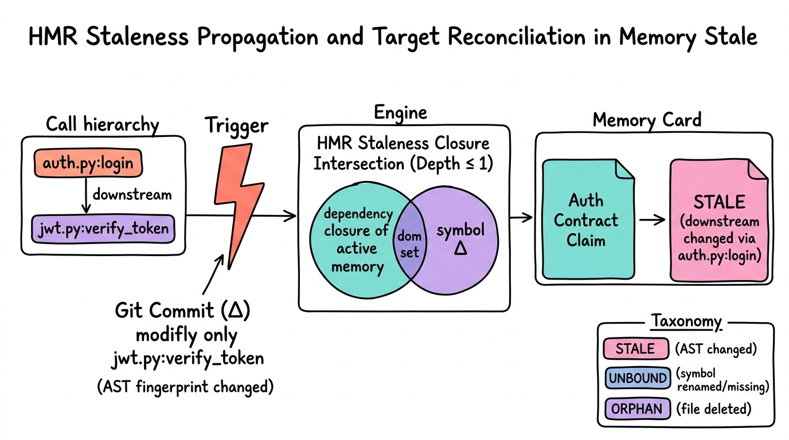

<p align="center">
  <picture>
    <source media="(prefers-color-scheme: dark)" srcset="./assets/logo-dark.png">
    
  </picture>
</p>

**Deterministic, evidence-bound project memory for coding agents.**  
*When the code moves, outdated memory dies. Automatically.*

[](#design-boundaries)
[](#how-it-works-in-practice)
[](#architectural-comparison--in-depth-analysis)
[](#what-is-stored)
[-brightgreen.svg)](#measured-evaluation)

Memory Stale gives **Codex**, **Claude Code**, and **Antigravity** persistent project memory anchored directly to the code AST. The moment referenced code or its static dependencies change, the claim is automatically invalidated and excluded from your agent's context.

No embeddings. No extra LLM calls. No cloud dependencies. Just deterministic AST fingerprinting and local Git hooks.

---

## The Problem: Stale Memory Rot

AI coding agents remember facts across tasks, but code changes constantly. Without continuous code-level verification, persistent memory quickly turns into **authoritative hallucinations**:

```text
Task 1  Agent records: "AuthService.login validates only password."
        Evidence: src/auth.py:AuthService.login

Task 2  You add Multi-Factor Authentication (MFA) to AuthService.login.

Task 3  Agent works on authentication again.
        ❌ Plain Memory / Vector DB: Injects the password-only claim as current truth.
        ✅ Memory Stale: Detects AST change in src/auth.py, marks memory STALE, and excludes it.
```

<p align="center">
  
</p>

---

## Architectural Comparison & In-Depth Analysis

AI coding assistants require different memory paradigms depending on the problem domain. Here is a deep architectural breakdown between **Semantic Vector Memory**, **Codebase Knowledge Graphs**, and **Memory Stale**:

| Capability | Vector DBs & LLM Memory *(e.g., Mem0, pgvector)* | Codebase Knowledge Graphs *(e.g., [Graphify](https://github.com/Graphify-Labs/graphify))* | Memory Stale |
| :--- | :--- | :--- | :--- |
| **Core Focus** | Unstructured semantic search across chat & docs | Full repository navigation & symbol relationships | Durable decisions & contracts tied to code |
| **When Code Changes** | Stale memories persist active (hallucination risk) | File-level incremental re-parsing (file SHA-256) | Symbol-level [HMR invalidation](#5-hmr-staleness-propagation--granular-lifecycle) via [AST fingerprints](#supported-languages-tree-sitter-ast) |
| **Downstream Awareness** | Blind to function caller/callee changes | Global call & type hierarchy | [Reactive coeffects](#4-reactive-coeffects--in-memory-reverse-dependency-index) (invalidates if callees change) |
| **Hook Latency & Speed** | 100–500ms (external embedding APIs) | Batch generation / graph traversals | <10ms local hook execution (`O(Δ symbols)`) |
| **Storage & Versioning** | External binary vector databases | Graph databases or generated artifacts | 100% Local Git Markdown ([OKF v0.2 format](#stored-format-open-knowledge-format-okf-v02)) |

### Deep Dive: Why Architectural Mismatches Cause Stale Hallucinations

#### 1. Invalidation Mechanics: Cosine Proximity vs. AST-Normalized HMR
* **Vector DBs (Semantic Distance)**: Vector embeddings compute geometric proximity in a high-dimensional latent space. If an agent records *"AuthService.login only requires password"*, and you subsequently rewrite `login()` to enforce MFA, the embedding vector of the claim does not change. When the agent later queries *"How does authentication work?"*, the cosine similarity remains high ($\ge 0.90$). The vector database confidently injects obsolete information as current truth.
* **Codebase Knowledge Graphs (File-Level Hash)**: Tools like [Graphify](https://github.com/Graphify-Labs/graphify) re-parse files when the file's SHA-256 changes. While this refreshes the structural topology, it re-indexes on non-semantic edits (e.g., formatting, comments) and is designed to answer *"what code exists right now?"* rather than *"are historical agent decisions still valid?"*.
* **Memory Stale (Tree-sitter HMR Invalidation)**: Normalizes code symbols into comment-free, formatting-invariant Tree-sitter AST hashes. When a Git diff touches a referenced symbol or any downstream callee within its dependency closure, the claim is instantaneously transitioned to `STALE` and excluded from the prompt injection window.

#### 2. Downstream Propagation: Isolated Chunks vs. Reactive Coeffects
* **Vector DBs**: Text chunks are stored as isolated units. If function `A()` relies on helper `B()`, modifying `B()` leaves the memory of `A()` untouched, causing subtle logic regressions.
* **Codebase Knowledge Graphs**: Map the entire repository into a global directed graph, providing deep topological navigation for architectural exploration.
* **Memory Stale**: Formulates memory evidence as **reactive coeffects** (what a claim requires from its environment). Changes to downstream functions propagate staleness upward to invalidate dependent memories with explicit causation (e.g., `invalidated via auth.py:verify_token`).

#### 3. Execution Latency in Agent Loops: Cloud APIs vs. In-Memory Reverse Index
* **Vector DBs**: Generating embeddings on prompt submission or Git hooks introduces network round-trips (100–500ms per call) and token costs, making synchronous hook-driven validation prohibitive.
* **Codebase Knowledge Graphs**: Rebuilding or traversing large code graphs is computationally heavy, typically suited for on-demand exploration rather than real-time hook blocking.
* **Memory Stale**: Maintains an in-memory `ReverseDependencyIndex` (`SymbolLocator -> Set[MemoryId]`). On `UserPromptSubmit` or Git lifecycle hooks, staleness resolution is `O(Δ symbols)`—proportional only to the modified lines in `git diff`, executing in under 10ms with zero network requests.

#### 4. Auditability and Concurrency: Black Boxes vs. Git-Native OKF v0.2
* **Vector DBs**: Embeddings reside in external, binary vector stores (e.g., Qdrant, Pinecone, pgvector) that cannot be reviewed in pull requests or synchronized deterministically across branches.
* **Memory Stale**: Every memory is an immutable, human-readable Open Knowledge Format (OKF v0.2) Markdown file in `.agents/skills/.agent-memory/memories/`. It uses **Inertial Target Reconciliation** to reject stale writes if the codebase was modified concurrently during the agent's turn.

---

> 💡 **Architectural Summary**:
> * **Vector DBs** excel at fuzzy semantic search across free-form conversation logs and unstructured documentation.
> * **Knowledge Graphs ([Graphify](https://github.com/Graphify-Labs/graphify))** excel at full-codebase structural discovery and global relationship navigation.
> * **Memory Stale** is purpose-built for durable architectural decisions, contracts, and business logic, providing **deterministic certainty that outdated memories are purged the instant the code moves**.

---

## 60-Second Quickstart

Clone Memory Stale directly into your project's `.agents/skills/` directory and configure your harness:

```bash
# 1. Clone into your project's skills directory
git clone https://github.com/fagnermourafeitosa/memory-stale.git .agents/skills/memory-stale

# 2. Configure hooks and MCP for your harness:

# For Antigravity (workspace hooks + plugin MCP)
sh .agents/skills/memory-stale/scripts/install-project.sh . --harness antigravity

# For Claude Code (project hooks + project .mcp.json)
sh .agents/skills/memory-stale/scripts/install-project.sh . --harness claude

# For Codex (project hooks + project .mcp.json)
sh .agents/skills/memory-stale/scripts/install-project.sh . --harness codex
```

> **Requirements**: Git, `uv`, and Python 3.10+.  
> Restart or open a new agent session after installation to load hooks and the local MCP server.

---

## How It Works in Practice

Memory Stale runs transparently inside your agent's normal execution loop using lifecycle hooks:

<p align="center">
  
</p>

### 1. Transparent Capture
When your agent completes a coherent code change, it calls `memory.capture` via MCP:

```json
{
  "claim": "Failed jobs retry up to 3 times before surfacing error.",
  "durability_reason": "Background queue contract required by worker services.",
  "evidence": ["src/jobs.py:retry", "tests/test_jobs.py:test_retry_limit"],
  "retrieval_terms": ["retry limit", "background job retries"]
}
```

### 2. Static Provenance Graph Expansion
For symbol evidence, Memory Stale doesn't just watch one line — it builds a local static dependency graph up to 3 hops (direct calls and named reads):

```text
claim
  → supported_by src/jobs.py:retry
      → calls src/policy.py:max_retries
      → reads src/config.py:RETRY_LIMIT
```
If `src/policy.py:max_retries` changes tomorrow, the claim is automatically invalidated.

<p align="center">
  
</p>

### 3. Multilingual BM25S Retrieval
Active memories are ranked using field-weighted `bm25s` with Snowball stemming across natural language fields (`claim: 1.0`, `durability_reason: 0.5`, `retrieval_terms: 0.75`, `exact_locators: 2.0`). Exact symbols receive a `100.0` boost.

### 4. Reactive Coeffects & In-Memory Reverse Dependency Index
Memory Stale models evidence as **active reactive coeffects** rather than passive metadata (formalized in *Spatiotemporal Composability* — [Cordis Paper](https://github.com/cordiverse/paper/blob/main/paper.pdf)). Code entities act as *providers* and memories as *consumers* declaring environmental dependencies (`depends_on`).

Instead of naively scanning the entire memory corpus against all files ($O(N \times M)$), an in-memory `ReverseDependencyIndex` maps canonical symbol locators directly to dependent memory IDs. When Git changes occur, affected memories are resolved in $O(\Delta\text{symbols})$ time, maintaining near-zero hook latency without disk-based index files.

<p align="center">
  
</p>

### 5. HMR Staleness Propagation & Granular Lifecycle
Inspired by Hot Module Replacement (HMR) dependency graphs, Memory Stale tracks transitive downstream shifts. When a callee function (`jwt.py:verify_token`) changes, any active memory whose dependency closure intersects the modified set ($\text{Closure}(C(M)) \cap \Delta \neq \emptyset$) is automatically transitioned to `STALE`, citing the exact downstream propagation path (e.g., `changed via auth.py:login`).

The `EvidenceTarget` model decouples logical symbol identity from AST fingerprints to establish deterministic lifecycle states:
* `STALE`: Symbol identity exists in the AST, but the semantic fingerprint diverged.
* `UNBOUND`: Symbol locator missing from the source file (renamed or deleted).
* `ORPHAN`: Target source file deleted from the Git repository.

<p align="center">
  
</p>

---

## What is Stored (Zero Lock-in)

All memories and configurations live directly inside your project in Git-reviewable Markdown:

```text
.agents/skills/.agent-memory/
├── config.toml           # Budget, top_k, and auto-report settings
└── memories/
    └── 2026-08-18-auth-password-contract.md
```

### Stored Format: Open Knowledge Format (OKF v0.2)
Every memory file is an immutable OKF document:

```markdown
---
type: Memory Stale Claim
title: Auth password validation contract
status: stable
memory_stale:
  schema_version: 1
  id: mem_9f82a1
  status: active
  fingerprints:
    "src/auth.py:AuthService.login": "sha256:d8a92f..."
---

AuthService.login validates password against Argon2 hash with rate-limiting.
```

---

## Daily Workflow & Maintenance

You don't need to learn new CLI commands. Work normally with your harness:

* **Context Injection**: Automatic on every prompt submit.
* **Audit Stale Records**: Run `/memory-stale dream` in chat to review stale claims.
* **Visual Health Report**: Ask your agent for the "Memory Stale health report" to generate a standalone `memory-report.html` showing active vs. stale evidence.

---

## Supported Languages (Tree-sitter AST)

Automatic symbol extraction, structural normalization, and static call graph expansion are natively supported for:

* **Python**
* **TypeScript & JavaScript**
* **Go**
* **Rust**
* **Java & Kotlin**

*Unsupported languages intentionally have no speculative fallback — evidence remains file-level to prevent false confidence.*

---

## Measured Evaluation & Benchmark

Memory Stale is continuously benchmarked against a versioned, human-labeled corpus of **100 end-to-end repository lifecycle cases** (50 semantic changes, 50 behavior-preserving edits):

| Metric | Result | 95% Confidence Interval |
| :--- | :---: | :---: |
| **Overall Accuracy** | **86.0%** (86/100) | 77.9% – 91.5% |
| **Stale Precision** | **84.6%** (44/52) | 72.5% – 92.0% |
| **Stale Recall** | **88.0%** (44/50) | 76.2% – 94.4% |
| **Mean Reciprocal Rank (MRR)** | **0.450** | Position-aware ranking quality |
| **NDCG@5 Ranking Quality** | **0.540** | High-relevance context promotion |
| **Operational Failures** | **0 / 100** | 100% deterministic test stability |

### Reproduce Benchmark Locally
Run the 100-case evaluation suite anytime:

```bash
uv run pytest -m repository_evaluation
```

---

## Current Boundaries & Limitations

* **Lexical & Structural**: Memories are retrieved by exact code references, BM25S terms, and declared aliases. Pure conceptual queries with no vocabulary overlap are not retrieved.
* **Static Graph Bounds**: Provenance follows direct named declarations up to 3 hops (64 nodes max). Dynamic reflection, monkey patching, and external runtime configuration are omitted rather than guessed.
* **Exclusion over Mutation**: Stale memories are excluded from prompt injection, never silently rewritten without verification.

---

## License

[MIT](LICENSE.txt)
