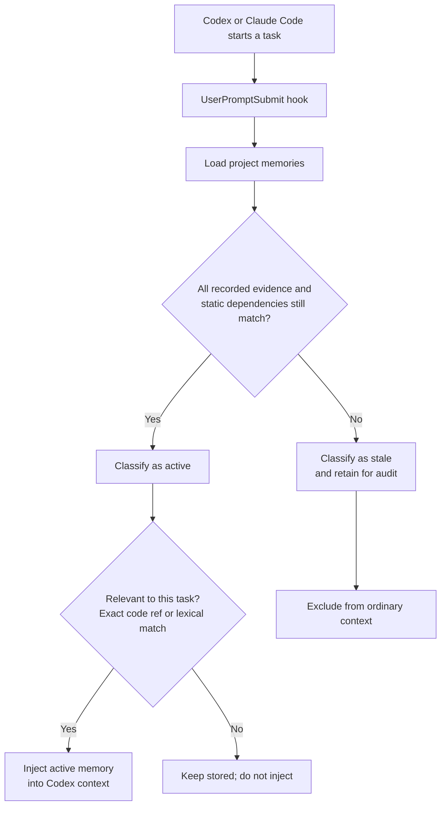
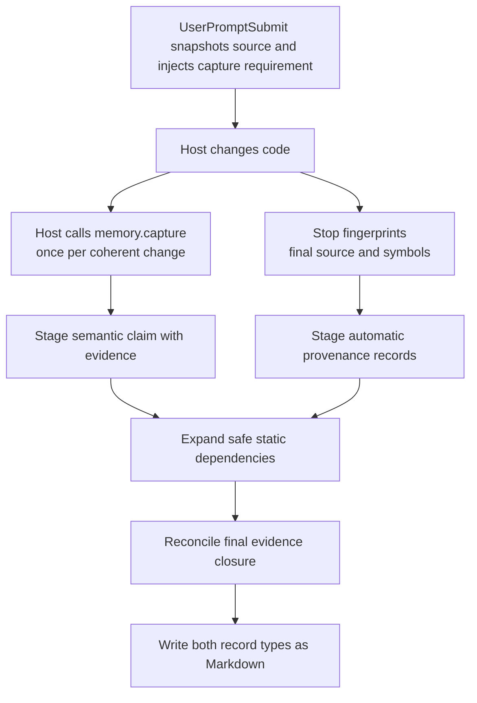

<p align="center">
  
</p>

# Memory Stale

**Project memory for Codex, Claude Code, and Antigravity that invalidates itself when its
recorded code evidence changes.**

Memory Stale prevents agent harnesses from silently reusing a stored project claim after
the code recorded as its evidence has changed. Future tasks keep useful context
across conversations, while every claim retains a deterministic freshness
boundary and a reviewable source.

It is installed per repository with harness-specific hooks over one deterministic
core. Codex, Claude Code, and Antigravity all use the same local MCP server, memory store,
evidence fingerprints, retrieval, and reconciliation. The Codex registration
is global discovery metadata that points only to that project's installed
runtime; Claude Code discovers the same runtime from the project `.mcp.json`;
Antigravity discovers the runtime from `.agents/plugins/memory-stale/mcp_config.json` and `.agents/hooks.json`.
Memory Stale does not use another model, embeddings, a hosted
service, or a vector database.

## Why it matters

Persistent memory is valuable until the implementation moves and an old fact
still looks authoritative. Consider three tasks in the same repository:

```text
Task 1  Agent records: "AuthService.login validates a password."
        Evidence: src/auth.py:AuthService.login

Task 2  Another change adds MFA to AuthService.login.

Task 3  Agent works on authentication again.
```

Without a freshness check, Task 3 can receive the password-only claim as if it
still described the current implementation. Memory Stale fingerprints the
recorded evidence and its bounded, statically resolved repository dependencies,
detects when any reachable evidence changes, marks the claim `stale`, and
excludes it from ordinary context.

| After recorded code changes | Plain stored context | Memory Stale |
| --- | --- | --- |
| Old claim availability | Can remain available | Excluded when its recorded evidence changes |
| Freshness decision | Not evidence-aware | Deterministic fingerprint comparison |
| Audit trail | System-dependent | Claim, evidence, revisions, and invalidation reason in Markdown |
| Hosted dependency | System-dependent | None; storage and evaluation stay local |

```text
unchanged evidence closure → active memory → available to agent
changed reachable evidence → stale memory  → excluded until revalidated
```

In the checked-in 100-case end-to-end corpus, the post-graph runtime reached
**86.0% overall accuracy**, **84.6% stale precision**, and **88.0% stale
recall**. It classified every direct local change and every declared
evidence-graph case correctly; the before/after result and remaining weaknesses
are documented in
[Measured evaluation](#measured-evaluation), not hidden behind the aggregate.

`active` means the recorded evidence is unchanged; it is not proof that a claim
is complete or universally true. `stale` means evidence changed, disappeared,
or no longer resolves; it is not proof the claim is false.

## Install in a project

The installer requires selecting the harness explicitly with `--harness`:

```bash
git clone https://github.com/fagnermourafeitosa/memory-stale.git /tmp/memory-stale

# Antigravity: workspace hooks, project skill, and plugin MCP discovery
sh /tmp/memory-stale/scripts/install-project.sh . --harness antigravity

# Codex: hooks plus global MCP discovery that points to this project's runtime
sh /tmp/memory-stale/scripts/install-project.sh . --harness codex

# Claude Code: project hooks, project skill, and project MCP discovery
sh /tmp/memory-stale/scripts/install-project.sh . --harness claude
```

Start a new conversation or reload the harness after installation so it reloads hooks and MCP.

The installer adds only target-project artifacts and preserves unrelated hook,
MCP, and settings entries:

```text
.agents/skills/memory-stale/  # skill, hooks, Python runtime, lockfile
.agents/hooks.json            # Antigravity PreInvocation, PostToolUse, Stop hooks
.agents/plugins/memory-stale/ # Antigravity project plugin and MCP entry
.codex/hooks.json             # Codex lifecycle registrations
.claude/settings.json         # Claude UserPromptSubmit, PostToolUse, Stop hooks
.claude/skills/memory-stale/  # Claude capture instructions
.mcp.json                     # Claude project MCP entry for the same local runtime
.git/memory-stale/runtime/    # local uv and grammar caches
```

For Codex, the installer registers `memory-stale` with `codex mcp add` using
the installed runtime's absolute path. It does not install Python packages
globally or point to the source checkout. Claude's `.mcp.json` server command
uses that exact same bootstrap. Incompatible `memory-stale` registrations stop
installation rather than being replaced. Repeating installation does not
duplicate hooks or MCP configuration.

Requirements: Git, `uv`, and Python 3.10+. Codex installation additionally
requires the Codex CLI with MCP support. Claude lifecycle turns require a
`prompt_id` to create isolated task state; when a payload omits it, Memory
Stale silently skips that lifecycle turn.

On the first hook or MCP invocation, the installed runtime uses its locked
dependencies to run `uv sync --frozen --no-dev`. This creates or reuses an
isolated environment at `.git/memory-stale/runtime/.venv`; its `uv` and
grammar caches also remain below `.git/memory-stale/runtime/`. It does not
modify the target project's `.venv` or install packages globally.

## How memory is discovered and classified

On every task, the `UserPromptSubmit` hook considers only records whose evidence
is still valid. It retrieves relevant active claims deterministically: exact
paths or symbols receive a `100.0` boost, and remaining matches use
field-weighted BM25 ranking powered by `bm25s` with language-aware Snowball stemming
for natural language fields. Claims have weight `1.0`, durability reasons
have weight `0.5`, host-declared retrieval terms have weight `0.75`, and
evidence locators have weight `2.0`. Locator paths and symbols are split into
searchable structural components, including path segments, file extensions,
snake case, kebab case, and camel case, isolated from linguistic stemmers.

When a later task may add product vocabulary to a claim or code reference, the
host may supply up to eight `retrieval_terms` during capture. For example, a
claim about an extra login factor can declare `MFA` or `second-factor
authentication`. Codex or Claude Code chooses these opaque terms while already
authoring the claim; the local runtime only trims, bounds, stores, and matches
them lexically. It does not extract entities, expand synonyms, use embeddings,
or call another model. Terms are not evidence and never affect whether a memory
is `active` or `stale`. A term alone is never enough to inject context: the
same prompt must also match the claim or an evidence locator. For example,
`MFA` alone does not retrieve a claim about a login flow, while `MFA login` can.

Exact locators bypass lexical cutoffs. Other candidates need a combined BM25
score of at least `0.25` and must be within 50% of the strongest candidate for
the prompt. These fixed gates keep terms as supplementary ranking vocabulary;
they are not a host assertion accepted as retrieval truth.

After that ranking, Memory Stale retains only the first `top_k` candidates in
deterministic score/ID order (five by default), then applies the token budget.
This makes `top_k` a context-selection limit: a larger `context_budget` cannot
cause lower-ranked candidates outside the selected prefix to be injected.



This means a comment-only or formatting-only edit does not invalidate a memory,
while a semantic change to its referenced source or a safely resolved dependency
does.

For `symbol` and `test` evidence, the runtime constructs a small static
provenance graph before persisting the revision. It records direct calls and
reads of uniquely resolved repository declarations, then follows those
dependencies transitively up to three edges and 64 total evidence nodes. Every
automatic edge is fingerprinted and stored with the revision:

```text
claim
  → supported_by auth.py:login
      → calls policy.py:allow_login
      → reads auth.py:MFA_REQUIRED
```

Same-source calls and named reads are supported for Python, JavaScript,
TypeScript, Go, Java, Kotlin, and Rust. Python named imports and JavaScript or
TypeScript relative named imports may cross files only when they map to exactly
one repository declaration. Imports never make a revision depend on a complete
module. Ambiguous names, dynamic receivers, callbacks, wildcard imports,
inheritance dispatch, framework conventions, external packages, and runtime
configuration are omitted rather than guessed; they may still be represented
through explicit `depends_on` evidence.

The stored extractor version and `complete` or `bounded` status describe the
static expansion that was actually attempted. They do not claim that the graph
captures every runtime dependency or proves the claim true.

## How a memory is created

Every supported code change produces two complementary records. The local
runtime creates deterministic provenance for the added or changed code
locations. The host instance performing the task submits a concise semantic
claim describing what the coherent change now does or guarantees. Memory Stale
does not ask another LLM or generate that claim inside the local engine.

The host writes the semantic claim, durability reason, and retrieval terms in
the same natural language as the user's prompt, declaring the language code (e.g. `pt`, `en`)
at capture time. The local runtime indexes the text using `bm25s` with the corresponding
Snowball stemmer without requiring embeddings or external LLM calls. Semantic retrieval across different
languages is not guaranteed, while exact paths and symbols remain
language-independent.



For example, one coherent change may create these automatic provenance records:

```text
Automatic change record: changed symbol src/jobs.py:retry.
Automatic change record: changed symbol tests/test_jobs.py:test_retry_limit.
```

Alongside them, Codex submits the memory content used for conceptual retrieval:

```text
Failed jobs retry at most three times before surfacing the final failure.
Evidence: src/jobs.py:retry, tests/test_jobs.py:test_retry_limit
Retrieval terms: retry limit, background job retries
```

The claim supplies what later tasks should remember and participates in lexical
retrieval. Optional host-declared retrieval terms add bounded task vocabulary
with less lexical weight than the claim. Provenance supplies exact code matching
and determines whether the claim remains `active`. If semantic capture does not
cover a changed location, `Stop` preserves its automatic provenance and reports
the missing coverage.

## Daily use

Memory maintenance is automatic in both Codex and Claude Code:

1. `UserPromptSubmit` retrieves relevant active memory.
2. `PostToolUse` records work performed during the task.
3. The host calls `memory.capture` before its final response once per coherent
   supported-code change.
4. `Stop` captures automatic provenance, persists both record types, reports
   semantic coverage gaps, and marks affected existing records stale.

Ask Codex or Claude Code to work normally; the installed skill and hooks handle
this protocol without requiring a memory command. For explicit maintenance,
use:

```text
/memory-stale dream
```

Ask Codex for the Memory Stale health report to generate the local HTML view of
active/stale memories, evidence, and invalidation reasons.

## What is stored

Durable records and configuration live in the target project:

```text
.agents/skills/.agent-memory/memories/*.md
.agents/skills/.agent-memory/config.toml
```

The installer creates `config.toml` with these editable defaults:

```toml
# Maximum number of tokens of active memory injected into task context.
context_budget = 1500

# Maximum number of highest-ranked active memories injected per task.
top_k = 5

# Generate the optional HTML health report after each completed turn.
auto_report = false

# Repository-relative path used when an HTML report is requested.
report_path = "memory-report.html"
```

The HTML health report is optional: it is created only when explicitly
requested or after setting `auto_report = true`.

The repository-root `.agents/` tree is operational infrastructure, not project
evidence. Memory Stale excludes it from change discovery, automatic capture,
explicit evidence, retrieval, and Dream audits even when its files are tracked.
Users do not need to add `.agents/` to `.gitignore` for this boundary to apply.
The exclusion does not prevent the installed hooks and MCP server from running
there or the memory store and reports from reading records there.

Memory files are Git-reviewable Markdown. Commit them when the team wants to
share project knowledge. Turn ledgers and runtime caches remain under `.git/`.

Each memory file is an [Open Knowledge Format (OKF) v0.2](https://github.com/GoogleCloudPlatform/knowledge-catalog/blob/main/okf/SPEC.md)
concept with `type: Memory Stale Claim`. Its standard frontmatter makes the
claim's sources, producer, deterministic verification event, and broad document
lifecycle readable by other OKF consumers. Memory Stale places its own
fingerprints, evidence graph, exact `active`/`stale`/`superseded` state, and
invalidation reasons under the `memory_stale` extension. OKF is the portable
envelope; Memory Stale remains responsible for resolving evidence and deciding
freshness. An `active` memory is `stable` in the OKF lifecycle, while a `stale`
or `superseded` revision is `deprecated`.

### Memory document contract

Each `memories/*.md` file is one immutable revision. Its Markdown body is the
complete semantic claim used for identity and retrieval; its OKF frontmatter
contains the display title, durability reason, sources, generation and
verification events, and mapped lifecycle status. The `memory_stale` extension
is required for current documents and records schema version, claim and
revision IDs, exact evidence fingerprints, evidence relationships, deterministic
freshness state, invalidation reasons, and the observed Git revision. `sources`
and `memory_stale.evidence` describe the same evidence set. An optional
`memory_stale.retrieval_terms` collection records the host-declared vocabulary
used by lexical retrieval. Changing those terms creates a new immutable revision
but does not alter evidence validation.

### Example: an active memory

**Claim**

GET `/api/teams/germany/defenders` returns exactly two German defenders in its
`defenders` JSON field. A fixed-cardinality response schema and a regression
test enforce that contract.

**Why it is durable**

This is the endpoint's public response contract, so its schema,
implementation, and regression test must stay synchronized.

**Current state**: `active`

**Evidence**

- `app/api/teams.py:GermanDefendersResponse`
- `app/api/teams.py:german_defenders`
- `tests/api/test_teams.py:test_german_defenders_returns_two_players`

The [complete stored document](examples/memory-stale-claim.md) includes the
machine-readable YAML frontmatter, IDs, fingerprints, and timestamps that the
runtime uses to verify this same claim. It is a storage format, not the
reader-oriented example above.

Each completed supported-code change stores automatic symbol/source provenance
and at least one host-authored semantic claim covering its coherent meaning.
Automatic primary evidence is a parsed symbol when available, otherwise a
parsed source file; it supports Python, JavaScript/TypeScript, Go, Java, Kotlin,
and Rust. Exact symbol and test evidence is expanded into the safely resolved
bounded static graph described above. Semantic captures may also use symbols,
tests, configuration nodes, and schema nodes. Unsupported languages intentionally
have no fallback.

## Design boundaries

- **Codex or Claude Code supplies meaning.** The host decides whether a fact
  is durable, states the claim, and may declare a few retrieval terms.
- **The local core supplies proof of recorded freshness.** It resolves declared
  evidence, adds only unambiguous static dependencies, fingerprints the bounded
  closure, retrieves active records, matches declared terms literally, and
  manages lifecycle state.
- **Hooks and MCP are adapters.** Codex and Claude payload adapters normalize
  into one deterministic Python lifecycle and share one MCP server.
- **Failures do not block coding.** Hook failures return actionable, non-blocking
  messages; writes are atomic.

## Measured evaluation

The current repository-lifecycle corpus contains 100 unique, human-labeled
cases: 50 semantic changes and 50 behavior-preserving edits across Python,
JavaScript, TypeScript, Go, Java, Kotlin, and Rust. A semantic change that should
make a memory stale is the positive class.

| Human label | Observed stale | Observed active |
| --- | ---: | ---: |
| Changed | 44 true stale | 6 missed changes |
| Preserved | 8 false stale | 42 true active |

| Corpus metric | Result | 95% Confidence Interval (95% CI) |
| --- | ---: | ---: |
| Overall accuracy | 86/100 (86.0%) | 77.9–91.5% |
| Stale precision | 44/52 (84.6%) | 72.5–92.0% |
| Stale recall | 44/50 (88.0%) | 76.2–94.4% |
| Stale F1 | 86.3% | — |
| Specificity | 42/50 (84.0%) | 71.5–91.7% |
| Unnecessary revalidation | 8/50 (16.0%) | 8.3–28.5% |
| Missed semantic changes | 6/50 (12.0%) | 5.6–23.8% |
| Unweighted macro-family accuracy | 80.6% | — |

Before automatic static provenance, the same corpus produced 38 true stale, 12
missed changes, and 80.0% overall accuracy. The graph recovered 6 of the 12
incomplete-provenance cases: Python functions reached through uniquely resolved
named imports. It introduced no additional false-stale result in this corpus.
The 6 remaining misses are the deliberately excluded YAML, JSON, TOML, and JSON
Schema reads plus module-qualified constant reads such as `limits.LIMIT` and
`defaults.timeout_seconds`. All 8 false-stale results remain conservative
classifications of behavior-preserving transformations. This is a controlled
before/after regression comparison, not an estimate for arbitrary real-world
repositories.

The same 100 cases now also contain 20 domain-oriented declared-term scenarios,
10 unrelated negative prompts, and four source-backed competing memories in
each declared-term repository. The declared-term scenarios deliberately include
existing false-stale and missed-change cases; they were not selected only from
outcomes the implementation already handles correctly. All 20 are evaluated
again with terms removed while claims, prompts, source changes, and distractors
remain fixed.

| Retrieval metric | Result | 95% Confidence Interval (95% CI) |
| --- | ---: | ---: |
| Overall accuracy with terms | 82/100 (82.0%) | 73.3–88.3% |
| Overall accuracy without terms, counterfactual | 82/100 (82.0%) | 73.3–88.3% |
| Target Recall@5 with terms | 32/40 (80.0%) | 65.2–89.5% |
| Silence / Exclusion rate with terms | 50/60 (83.3%) | 72.0–90.7% |
| Mean Reciprocal Rank (MRR), without → with | 0.413 → 0.450 | — |
| NDCG@5 (Ranking Quality), without → with | 0.512 → 0.540 | — |
| Declared-term Target Recall@5, without → with | 7/10 → 7/10 | — |
| Declared-term Silence / Exclusion rate, without → with | 3/10 → 3/10 | — |
| Declared-term Precision@5, without → with | 7/28 (25.0%) → 7/27 (25.9%) | — |
| Declared-term MRR, without → with | 0.550 → 0.700 | — |
| Declared-term NDCG@5, without → with | 0.589 → 0.700 | — |

Holding lifecycle outcomes fixed, the binary target inclusion inside `top_k = 5`
remains unchanged under the controlled counterfactual substitution (32/40 targets).
However, position-aware ranking metrics reveal the true effect of declared terms:
**MRR increases from 0.413 to 0.450** across the corpus (and from **0.550 to 0.700**
on declared-term targets), while **NDCG@5 increases from 0.512 to 0.540** overall
(and from **0.589 to 0.700** on declared-term targets), proving that host-supplied
vocabulary promotes relevant memories to higher rank positions without adding
unrelated context.

The 20 declared-term cases are pre-split before measurement: five expected
inclusions and five expected exclusions form calibration, and the same balance
forms holdout. Calibration is 2/10 (20.0%) with and without terms; holdout is
8/10 (80.0%) with and without terms. The holdout's target recall is 5/5, its
no-context exclusion is 3/5, and its MRR is 1.0, showing that the remaining
errors are lifecycle misses and unrelated active context, not a post-hoc
threshold selection.

### Methodology and reproducibility

Each case starts from an independently written semantic label and rationale. The
evaluator then creates a temporary Git repository and crosses the real
`UserPromptSubmit` hook, `memory.capture` MCP process, persisted Markdown, `Stop`
reconciliation, and later retrieval boundary. The final active/stale availability
is compared with the human label. Operational failures are reported separately
and cannot disappear into the semantic confusion matrix.

The inputs and exact per-case outcomes are reviewable in the
[versioned corpus](evaluator/corpus/repository-lifecycle-corpus.yaml), the
[pre-graph result](evaluator/results/2026-08-17-repository-lifecycle-evaluation.yaml),
the [post-graph result](evaluator/results/2026-08-17-post-static-provenance-graph.yaml),
and the [ranking-metrics result](evaluator/results/2026-08-18-post-ranking-metrics.yaml).
The [base evaluation contract](specs/21-quality-evaluation-100-samples.md),
[declared-term evaluation contract](specs/37-declared-retrieval-terms.md), and
[ranking-metrics evaluation contract](specs/41-retrieval-ranking-metrics.md)
document sample design and interpretation, while the
[end-to-end test](evaluator/tests/test_repository_lifecycle.py) reruns the corpus
and requires an exact baseline match.

On 2026-08-18, the post-ranking runtime with multilingual BM25S tokenization was run through all 100 cases plus the
20 held-constant counterfactual trials. It completed with no operational
failures. Lifecycle accuracy was 86%, while retrieval accuracy
reached 82% with 83.3% exclusion rate and measurable ranking gains (MRR 0.450, NDCG@5 0.540). The detailed
calibration, holdout, recall, exclusion, precision, distractor, and per-case
outcomes are stored in the separate post-ranking result.

On 2026-08-15, commit `f6fe73d` was checked by repeating all 100 cases ten times:
1,000/1,000 lifecycle executions matched the baseline, with no operational
failure or divergent outcome. These repetitions measure deterministic stability;
they remain 100 unique semantic samples and do not narrow the intervals above.

To update the statistics intentionally, keep labels and fixtures independent of
product tuning, version any corpus or behavior change through a numbered spec,
run the end-to-end evaluation, review every changed outcome, record a new dated
baseline, and update this section in the same change. The reproducibility check
is intentionally excluded from the standard test suite and runs only when its
marker is selected explicitly:

```bash
uv run pytest -m repository_evaluation
```

These are descriptive scores for a curated regression corpus, not estimates of
accuracy across arbitrary repositories.

## Current limitations

- Retrieval is lexical and structural; conceptually related memories may not be
  retrieved when the prompt shares neither relevant terms nor code references.
- Declared terms require a claim or locator corroboration and only affect
  ranking. They cannot recover an alias-only prompt. Their ranking effect is
  observable only when more eligible candidates exist than the selected
  `top_k` prefix.
- Stale records are excluded from retrieval, not automatically rewritten.
  Revalidate them with Dream or create a new capture.
- Overloads, anonymous functions, generated code, macros, and partial classes
  may not resolve at the intended symbol granularity.
