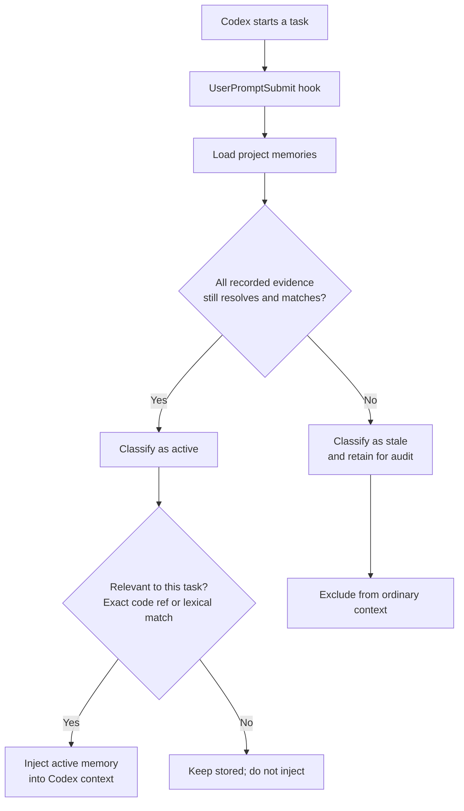
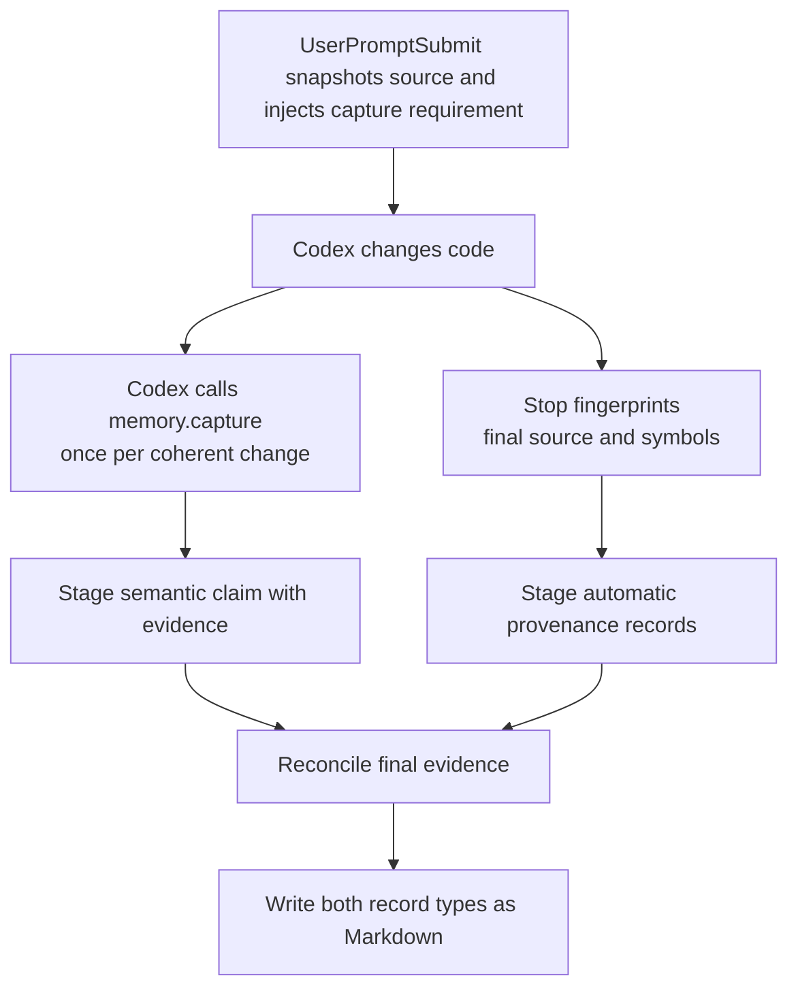

# Memory Stale

**Project memory for Codex that invalidates itself when its recorded code
evidence changes.**

Memory Stale prevents Codex from silently reusing a stored project claim after
the code recorded as its evidence has changed. Future tasks keep useful context
across conversations, while every claim retains a deterministic freshness
boundary and a reviewable source.

It is installed per repository as a local Codex skill with hooks. Its MCP
server is registered once in Codex's global configuration, but the entry points
only to that project's installed runtime. It does not use Codex Plugins,
another model, embeddings, a hosted service, or a vector database.

## Why it matters

Persistent memory is valuable until the implementation moves and an old fact
still looks authoritative. Consider three tasks in the same repository:

```text
Task 1  Codex records: "AuthService.login validates a password."
        Evidence: src/auth.py:AuthService.login

Task 2  Another change adds MFA to AuthService.login.

Task 3  Codex works on authentication again.
```

Without a freshness check, Task 3 can receive the password-only claim as if it
still described the current implementation. Memory Stale fingerprints the
recorded evidence, detects that `AuthService.login` changed, marks the claim
`stale`, and excludes it from ordinary context.

| After recorded code changes | Plain stored context | Memory Stale |
| --- | --- | --- |
| Old claim availability | Can remain available | Excluded when its recorded evidence changes |
| Freshness decision | Not evidence-aware | Deterministic fingerprint comparison |
| Audit trail | System-dependent | Claim, evidence, revisions, and invalidation reason in Markdown |
| Hosted dependency | System-dependent | None; storage and evaluation stay local |

```text
unchanged evidence → active memory → available to Codex
changed evidence   → stale memory  → excluded until revalidated
```

In the checked-in 100-case end-to-end corpus, Memory Stale reached **80.0%
overall accuracy**, **82.6% stale precision**, and **76.0% stale recall**. It
classified every direct local change and every declared evidence-graph case
correctly; the remaining weaknesses are documented in
[Measured evaluation](#measured-evaluation), not hidden behind the aggregate.

`active` means the recorded evidence is unchanged; it is not proof that a claim
is complete or universally true. `stale` means evidence changed, disappeared,
or no longer resolves; it is not proof the claim is false.

## Install in a project

From the target Git repository, ask Codex:

> Install Memory Stale in this project from https://github.com/fagnermourafeitosa/memory-stale

Or run:

```bash
git clone https://github.com/fagnermourafeitosa/memory-stale.git /tmp/memory-stale
sh /tmp/memory-stale/scripts/install-project.sh .
```

The installer adds only target-project artifacts:

```text
.agents/skills/memory-stale/  # skill, hooks, Python runtime, lockfile
.codex/hooks.json             # lifecycle registrations
.git/memory-stale/runtime/    # local uv and grammar caches
```

It preserves unrelated hook entries and registers `memory-stale` with
`codex mcp add` using the installed runtime's absolute path. The Codex
registration is global, but it does not install Python packages globally or
point to the source checkout. If Codex already has a `memory-stale` server,
installation stops with the CLI's error instead of replacing it. Start a new
Codex conversation after installation so it loads the registered server.

Requirements: Git, `uv`, Python 3.10+, and the `codex` CLI with MCP support.

On the first hook or MCP invocation, the installed runtime uses its locked
dependencies to run `uv sync --frozen --no-dev`. This creates or reuses an
isolated environment at `.git/memory-stale/runtime/.venv`; its `uv` and
grammar caches also remain below `.git/memory-stale/runtime/`. It does not
modify the target project's `.venv` or install packages globally.

## How memory is discovered and classified

On every task, the `UserPromptSubmit` hook considers only records whose evidence
is still valid. It retrieves relevant active claims deterministically: exact
paths or symbols receive a `100.0` boost, and remaining matches use
field-weighted lexical BM25 ranking. Claims have weight `1.0`, durability reasons
have weight `0.5`, and evidence locators have weight `2.0`. Locator paths and
symbols are split into searchable structural components, including path
segments, file extensions, snake case, kebab case, and camel case.



This means a comment-only or formatting-only edit does not invalidate a memory,
while a semantic change to its referenced source does.

## How a memory is created

Every supported code change produces two complementary records. The local
runtime creates deterministic provenance for the added or changed code
locations. The Codex instance performing the task submits a concise semantic
claim describing what the coherent change now does or guarantees. Memory Stale
does not ask another LLM or generate that claim inside the local engine.



For example, one coherent change may create these automatic provenance records:

```text
Automatic change record: changed symbol src/jobs.py:retry.
Automatic change record: changed symbol tests/test_jobs.py:test_retry_limit.
```

Alongside them, Codex submits the memory content used for conceptual retrieval:

```text
Failed jobs retry at most three times before surfacing the final failure.
Evidence: src/jobs.py:retry, tests/test_jobs.py:test_retry_limit
```

The claim supplies what later tasks should remember and participates in lexical
retrieval. Provenance supplies exact code matching and determines whether the
claim remains `active`. If semantic capture does not cover a changed location,
`Stop` preserves its automatic provenance and reports the missing coverage.

## Daily use

Memory maintenance is automatic:

1. `UserPromptSubmit` retrieves relevant active memory.
2. `PostToolUse` records work performed during the task.
3. Codex calls `memory.capture` before its final response once per coherent
   supported-code change.
4. `Stop` captures automatic provenance, persists both record types, reports
   semantic coverage gaps, and marks affected existing records stale.

Ask Codex to work normally; the installed skill and hooks handle this protocol
without requiring the user to issue a memory command. For explicit maintenance,
use:

```text
/memory-stale dream
```

Ask Codex for the Memory Stale health report to generate the local HTML view of
active/stale memories, evidence, and invalidation reasons.

## What is stored

Durable records and configuration live in the target project:

```text
.agents/skills/.agent-memory/memories/*.md
.agents/skills/.agent-memory/config.toml
```

The repository-root `.agents/` tree is operational infrastructure, not project
evidence. Memory Stale excludes it from change discovery, automatic capture,
explicit evidence, retrieval, and Dream audits even when its files are tracked.
Users do not need to add `.agents/` to `.gitignore` for this boundary to apply.
The exclusion does not prevent the installed hooks and MCP server from running
there or the memory store and reports from reading records there.

Memory files are Git-reviewable Markdown. Commit them when the team wants to
share project knowledge. Turn ledgers and runtime caches remain under `.git/`.

Each memory file is an [Open Knowledge Format (OKF) v0.2](https://github.com/GoogleCloudPlatform/knowledge-catalog/blob/main/okf/SPEC.md)
concept with `type: Memory Stale Claim`. Its standard frontmatter makes the
claim's sources, producer, deterministic verification event, and broad document
lifecycle readable by other OKF consumers. Memory Stale places its own
fingerprints, evidence graph, exact `active`/`stale`/`superseded` state, and
invalidation reasons under the `memory_stale` extension. OKF is the portable
envelope; Memory Stale remains responsible for resolving evidence and deciding
freshness. An `active` memory is `stable` in the OKF lifecycle, while a `stale`
or `superseded` revision is `deprecated`.

Each completed supported-code change stores automatic symbol/source provenance
and at least one Codex-authored semantic claim covering its coherent meaning.
Automatic primary evidence is a parsed symbol when available, otherwise a
parsed source file; it supports Python, JavaScript/TypeScript, Go, Java, Kotlin,
and Rust. Semantic captures may also use symbols, tests, configuration nodes,
and schema nodes. Unsupported languages intentionally have no fallback.

## Design boundaries

- **Codex supplies meaning.** It decides whether a fact is durable and states
  the claim.
- **The local core supplies proof of freshness.** It resolves declared evidence,
  fingerprints it, retrieves active records, and manages lifecycle state.
- **Hooks and MCP are adapters.** They keep the deterministic Python core
  independent from Codex transport and configuration.
- **Failures do not block coding.** Hook failures return actionable, non-blocking
  messages; writes are atomic.

## Measured evaluation

The current repository-lifecycle corpus contains 100 unique, human-labeled
cases: 50 semantic changes and 50 behavior-preserving edits across Python,
JavaScript, TypeScript, Go, Java, Kotlin, and Rust. A semantic change that should
make a memory stale is the positive class.

| Human label | Observed stale | Observed active |
| --- | ---: | ---: |
| Changed | 38 true stale | 12 missed changes |
| Preserved | 8 false stale | 42 true active |

| Corpus metric | Result | Descriptive Wilson 95% interval |
| --- | ---: | ---: |
| Overall accuracy | 80/100 (80.0%) | 71.1–86.7% |
| Stale precision | 38/46 (82.6%) | 69.3–90.9% |
| Stale recall | 38/50 (76.0%) | 62.6–85.7% |
| Stale F1 | 79.2% | — |
| Specificity | 42/50 (84.0%) | 71.5–91.7% |
| Unnecessary revalidation | 8/50 (16.0%) | 8.3–28.5% |
| Missed semantic changes | 12/50 (24.0%) | 14.3–37.4% |
| Unweighted macro-family accuracy | 72.2% | — |

All 12 missed changes are incomplete-provenance cases, where changed config,
policy, schema, constants, or dependencies were not declared as evidence. All
8 false-stale results are conservative classifications of behavior-preserving
transformations. Direct local changes, declared evidence graphs, preserving
edits, and repository-shape cases matched their labels in this corpus.

### Methodology and reproducibility

Each case starts from an independently written semantic label and rationale. The
evaluator then creates a temporary Git repository and crosses the real
`UserPromptSubmit` hook, `memory.capture` MCP process, persisted Markdown, `Stop`
reconciliation, and later retrieval boundary. The final active/stale availability
is compared with the human label. Operational failures are reported separately
and cannot disappear into the semantic confusion matrix.

The inputs and exact per-case outcomes are reviewable in the
[versioned corpus](evaluator/corpus/repository-lifecycle-corpus.yaml) and
[dated result](evaluator/results/2026-08-16-repository-lifecycle-evaluation.yaml).
The [evaluation contract](specs/21-quality-evaluation-100-samples.md) documents
sample design and interpretation, while the
[end-to-end test](evaluator/tests/test_repository_lifecycle.py) reruns the corpus
and requires an exact baseline match.

On 2026-08-16, the field-weighted locator retrieval implementation was run
through all 100 cases. It reproduced the matrix and every per-case lifecycle
and retrieval outcome above exactly, with no operational failures.

On 2026-08-15, commit `f6fe73d` was checked by repeating all 100 cases ten times:
1,000/1,000 lifecycle executions matched the baseline, with no operational
failure or divergent outcome. These repetitions measure deterministic stability;
they remain 100 unique semantic samples and do not narrow the intervals above.

To update the statistics intentionally, keep labels and fixtures independent of
product tuning, version any corpus or behavior change through a numbered spec,
run the end-to-end evaluation, review every changed outcome, record a new dated
baseline, and update this section in the same change. The reproducibility check
is intentionally excluded from the standard test suite and runs only when its
marker is selected explicitly:

```bash
uv run pytest -m repository_evaluation
```

These are descriptive scores for a curated regression corpus, not estimates of
accuracy across arbitrary repositories.

## Current limitations

- Retrieval is lexical and structural; conceptually related memories may not be
  retrieved when the prompt shares neither relevant terms nor code references.
- Stale records are excluded from retrieval, not automatically rewritten.
  Revalidate them with Dream or create a new capture.
- Overloads, anonymous functions, generated code, macros, and partial classes
  may not resolve at the intended symbol granularity.
